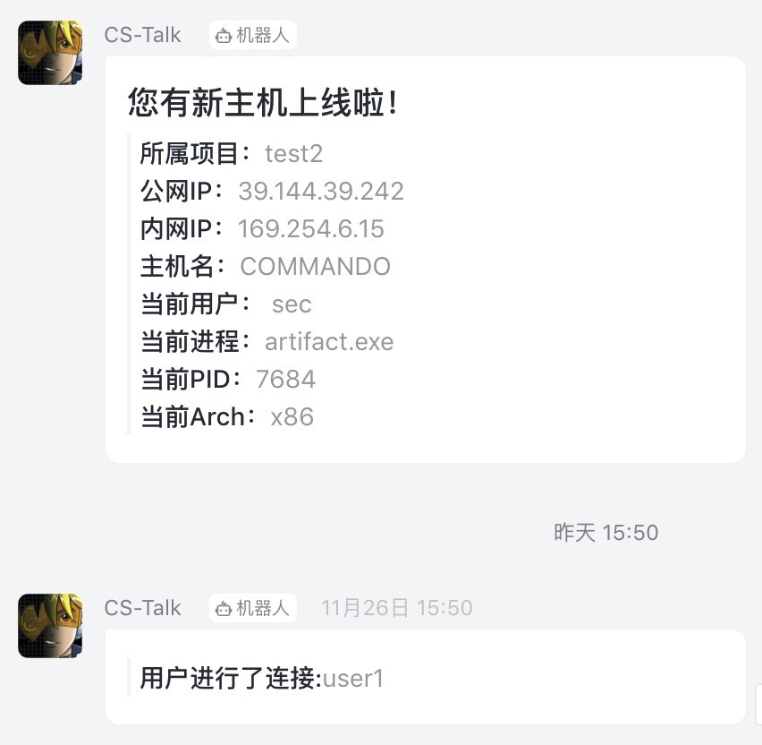
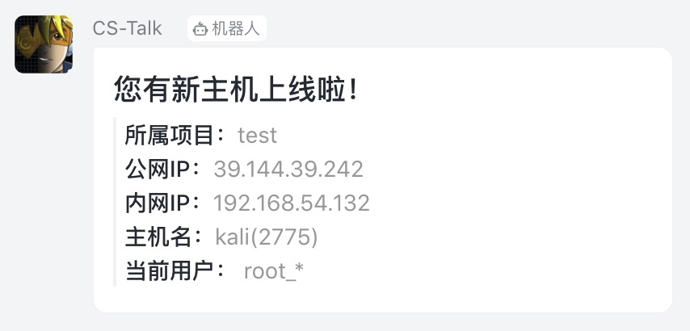

# Aggressor_dingding
cobaltstrike 上线提醒
# 目前支持以下情况通知
cobaltstrike 4.x/CrossC2
>* initial beacon
>* ssh session
>* joined 
# Usage:
>* ./agscript cs服务端IP 端口 任意用户名 cs密码 dingding.cna
>* ./agscript 127.0.0.1 63790 admin password dingding.cna
- 
- 
# From
>* https://github.com/x51/Cobalt-Strike-Scripts/
>* https://m.dingtalk.com/qidian/help-detail-20781541
